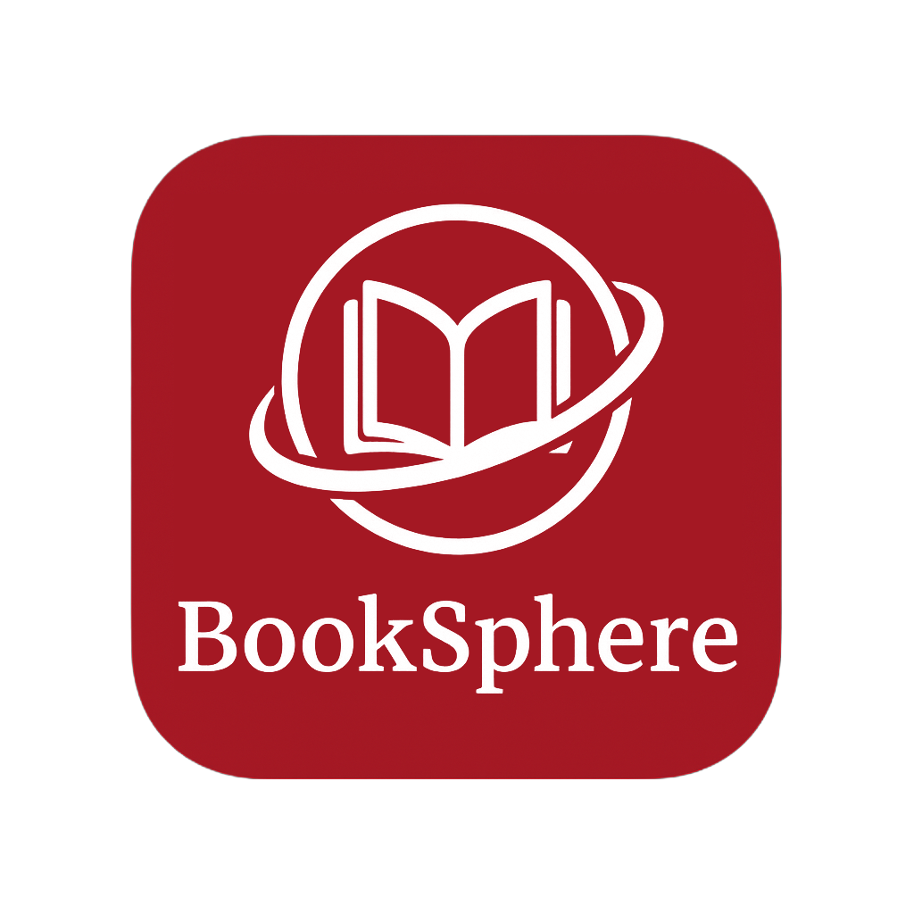
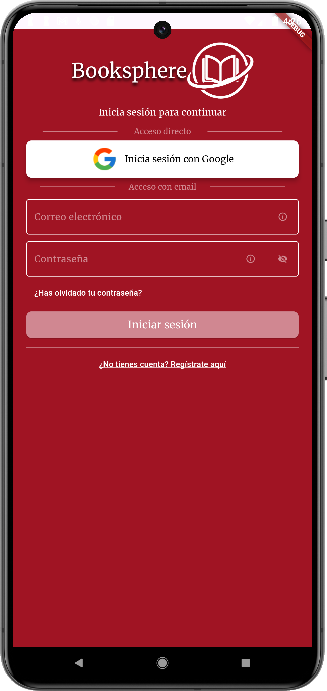
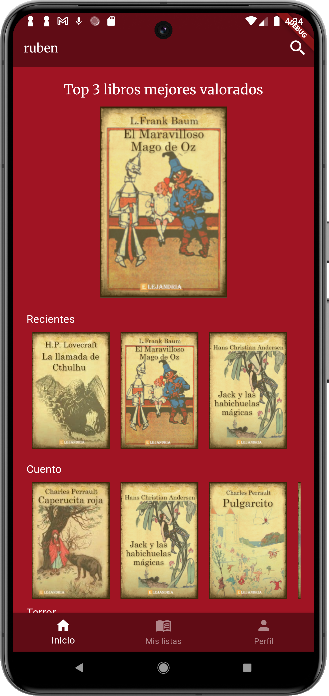
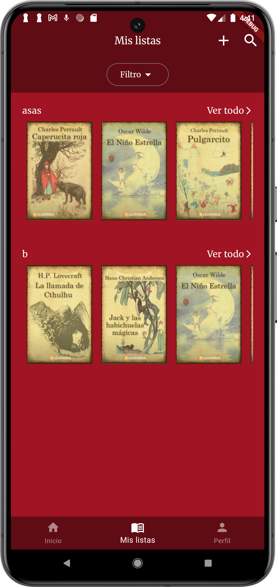
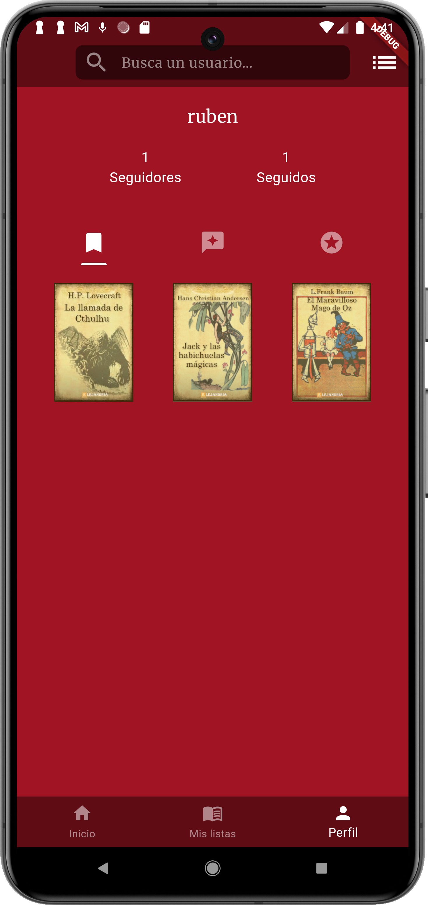
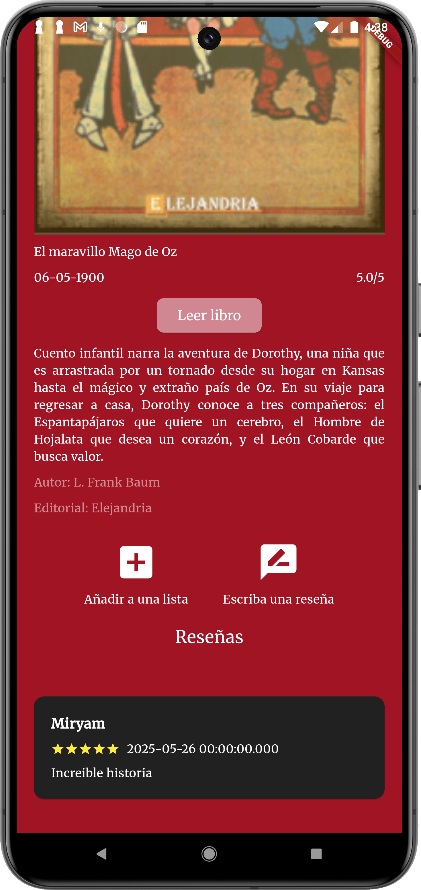
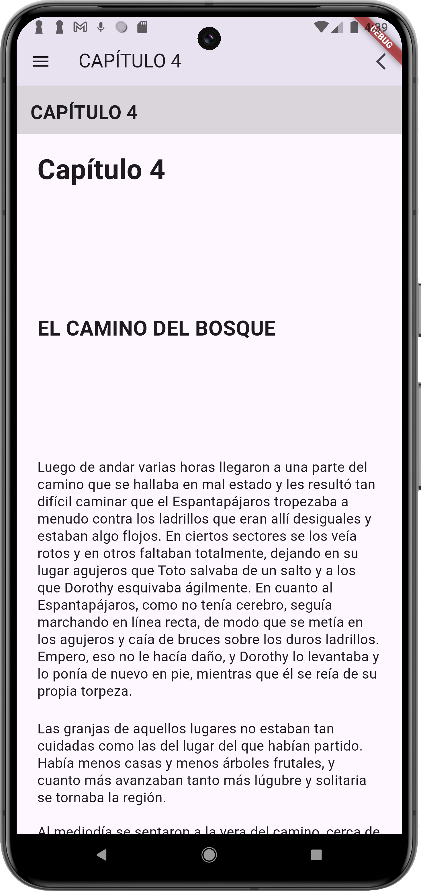

<h1 align="center">
  <br>
  
</h1>

<h4 align="center">Aplicación social de lectura de libros</h4>

<p align="center">
  
  
  
  
  
</p>

<p align="center">
  <a href="#descripción-del-proyecto">Descripción del proyecto</a> •
  <a href="#funcionalidades-principales">Funcionalidadades principales</a> •
  <a href="#tecnologías-usadas">Tecnologías usadas</a> •
  <a href="#despliegue">Despliegue</a> •
   <a href="#información-personal">Información personal</a> •
</p>

<p align="center">
  
  
  
</p>

<p align="center">
  
  
  
</p>

## Descripción del proyecto 
Booksphere es una plataforma digital multiplataforma que fusiona la lectura de libros electrónicos con la interacción social entre usuarios. Desarrollada como parte de un proyecto final del ciclo formativo de Desarrollo de Aplicaciones Multiplataforma, ofrece una experiencia de lectura enriquecida, colaborativa y personalizada.

## Funcionalidades principales

### 📱 App móvil (Flutter)

- 📖 Lectura de libros en formato EPUB.
- 🔖 Guardado de progreso de lectura.
- 📚 Crear listas personalizadas de libros.
- 👥 Seguir a otros usuarios y ver sus perfiles.
- 🔄 Carrusel dinámico de últimos libros leídos.
- 🧾 Visualización en el perfil de libros leídos y reseñados.
- ⭐ Reseñar libros con estrellas y comentarios.
- 🎯 Participar en desafíos de lectura.

### 💻 Web de administración (Angular)

- 📤 Subida de libros a Firebase Storage y almacenamiento de archivos en Firebase Storage.
- 🛠️ Gestión de libros: título, autor, portada, género...
- 🧹 Moderación del contenido y administración general.

## Tecnologías usadas

<ul>
  <li>📱 <strong>Flutter:</strong><br>
    Desarrollo de la app móvil.
  </li>
  <br>
  <li>💻 <strong>Angular:</strong><br>
    Interfaz web de administración para gestionar y subir libros,autores y editoriales.
  </li>
  <br>
  <li>☁️ <strong>Firebase</strong> como backend:
    <ul>
      <li>🔐 <strong>Authentication</strong> – Autenticación con correo y Google.</li>
      <li>🔥 <strong>Firestore</strong> – Base de datos en tiempo real.</li>
      <li>🗂️ <strong>Storage</strong> – Almacenamiento de archivos EPUB e imágenes.</li>
    </ul>
  </li>
</ul>


## Despliegue

### App

```bash
# 1. Clona el repositorio
git clone https://github.com/tu_usuario/tu_repositorio.git

# 2. Accede al directorio del proyecto
cd tu_repositorio

# 3. Instala dependencias de Flutter
flutter pub get

# 4. Instala la CLI de Firebase (si no la tienes)
npm install -g firebase-tools

# 5. Inicia sesión en Firebase
firebase login

# 6. Instala la CLI de FlutterFire
dart pub global activate flutterfire_cli

# (opcional) Añade FlutterFire al PATH si es necesario
export PATH="$PATH":"$HOME/.pub-cache/bin"

# 7. Configura Firebase con tu proyecto (esto crea firebase_options.dart)
flutterfire configure

# 8. Ejecuta la app en modo desarrollo
flutter run

# Para Android/iOS
flutter run -d android
flutter run -d ios

```
### Web

```bash

# 1. Clona el repositorio
git clone https://github.com/tu_usuario/tu_repositorio.git

# 2. Accede al directorio del proyecto
cd tu_repositorio

# 3. Instala dependencias del proyecto Angular
npm install

# 4. Instala la CLI de Firebase (si no la tienes)
npm install -g firebase-tools

# 5. Inicia sesión en Firebase
firebase login

# 6. Inicializa Firebase Hosting (elige "Hosting" y tu proyecto)
firebase init

# ❗ Cuando te pregunte:
# - ¿Qué quieres configurar? → selecciona "Hosting"
# - ¿Qué carpeta usar como public? → escribe `dist/<nombre-de-tu-app>`
# - ¿Configurar como SPA (single-page app)? → sí
# - ¿Sobrescribir index.html? → NO

# 7. Construye la app Angular para producción
ng build --configuration production

# 8. Despliega la app al hosting de Firebase
firebase deploy

## Información personal
```
[@RubenCG1997](https://github.com/RubenCG1997) || [LinkedIn](https://www.linkedin.com/in/ruben-camacho-gomez/)

